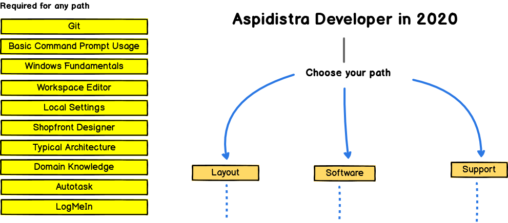

# Roadmap to becoming a Aspidistra developer in 2020

This is a ripoff of the notorious [Web Developer Roadmap](https://github.com/kamranahmedse/developer-roadmap) by Kamran Ahmed. I really like those charts because they do highlight gaps in knowledge for those of us who are less experienced, but obviously it's only a rough guide that a few (very startup-y, probably Ubuntu based) developers have put together for the entire community. Also, the specific technologies chosen in the original are probably  the 'best on the market' at time of writing, but not what most established companies are *actually likely to be using*. It's a bit aspirational, and also a bit unrealistic.

Below you will find my take, but with the tools and tech that Aspidistra uses instead. Enjoy.

***

If you think that these can be improved in any way, please do suggest. 

At the moment I'm only doing software because that's my role, if other departments are interested in being repped on this page I'm happy to design the chart as long as you tell me what to put.

## Introduction

## Layout Roadmap

<!--  

 -->

## Software Roadmap 

 

## Support Roadmap

<!--  

 -->

## 🚦 Wrap Up

If you think any of the roadmaps can be improved, let me know and I'll change it. Unfortunately you need proprietary software to modify the charts but I have a free license for 30 days and if I decide it's any good we might use it as an alternative to draw.io anyway. 

## 🙌 Contribution

> Have a look at [contribution docs](./CONTRIBUTING.md) for how to update any of the roadmaps
 
## License

Have a look at the [license file](./LICENSE) for details
